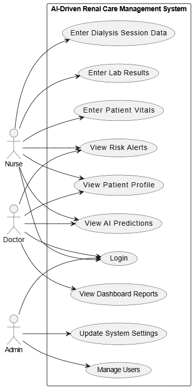
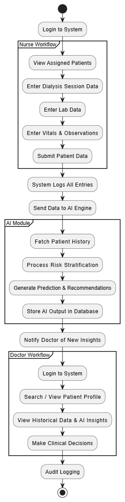

# AI-Driven Renal Care Management – Teaching Hospital Peradeniya

#### Team

- E/19/095, E.M.L.K. Edirisinghe, [email](mailto:e19095@eng.pdn.ac.lk)
- E/19/170, K.N.N. Jayawardhana, [email](mailto:e19170@eng.pdn.ac.lk)
- E/19/306, M.M.P.N. Rajakaruna, [email](mailto=e19306@eng.pdn.ac.lk)

#### Supervisor

- Dr. Upul Jayasinghe

#### Table of Contents

1. [Abstract](#abstract)
2. [Problem Statement](#problem-statement)
3. [Objectives](#objectives)
4. [System Design](#system-design)
5. [Methodology](#methodology)
6. [Technologies Used](#technologies-used)
7. [Ethics and Privacy](#ethics-and-privacy)
8. [Results and Analysis](#results-and-analysis)
9. [Documents](#documents)
10. [Conclusion](#conclusion)
11. [Publications](#publications)
12. [Links](#links)

---

## Abstract

Chronic Kidney Disease (CKD) is a growing burden in Sri Lanka. This project aims to develop an <b>AI-powered expert system</b> to assist in the management of hemodialysis patients at the Teaching Hospital Peradeniya. The system provides real-time monitoring, predictive analytics, and clinical decision support. By digitizing medical records and integrating advanced AI tools, it aims to improve patient outcomes, reduce complications, and enhance treatment personalization.

<i>Figure 1.1: CKD prevalence rates in Sri Lanka (2009–2016). <a href='https://doi.org/10.1016/j.scitotenv.2019.133767'>Source</a></i>

---

## Problem Statement

Traditional dialysis monitoring is manual, reactive, and prone to delays in detecting complications. With limited medical infrastructure in Sri Lanka, the need for scalable, intelligent systems is high. This project introduces an AI-driven approach to enable proactive care, address model adaptability challenges, and improve clinical trust through explainable AI (XAI).

---

## Objectives

### General Objective
To develop and validate an AI expert system that enhances dialysis management through real-time monitoring and predictive support.

### Specific Objectives

- Develop an ensemble ML model using Random Forest, XGBoost, and ANN.
- Identify essential clinical and demographic data for accurate predictions.
- Compare the AI system with traditional care models in terms of outcomes.
- Build an integrated expert system with a user-friendly clinical dashboard.
- Pilot the system at Teaching Hospital Peradeniya and gather clinical feedback.

---

## System Design

### 🏗️ System Architecture

<i>Figure: System architecture showing data pipelines, model inference, and interface components.</i>

### 🎯 Use Case Diagram

<i>Figure: Use case diagram highlighting interactions between clinicians, AI system, and patient records.</i>

### 🧩 Workflow Diagram

<i>Figure: Overall workflow of the AI-driven renal care system.</i>

---

## Methodology

### Phase 1: Machine Learning Model
- Supervised learning with 80/20 train-validation split
- Algorithms: RF, XGBoost, SVM, ANN
- Metrics: ROC-AUC, Accuracy, Precision, F1 Score

### Phase 2: AI Expert System
- **Knowledge Base**: Dialysis protocols and clinical history
- **Inference Engine**: Real-time monitoring with alerts
- **UI**: Clinician dashboard for data input and insights

### Phase 3: Pilot Study
- Conducted at Teaching Hospital Peradeniya
- Staff training and usability evaluation
- Feedback loop for iterative improvement

---

## Technologies Used

- **Programming**: Python
- **ML Frameworks**: TensorFlow, Scikit-learn, XGBoost, Keras
- **Backend**: FastAPI, Express.js
- **Frontend**: React.js
- **Database**: MySQL
- **MLOps**: CI/CD for real-time model deployment and monitoring

---

## Ethics and Privacy

- Ethical clearance from Faculty of Medicine, University of Peradeniya
- Approvals from Ministry of Health and hospital administration
- Informed consent from all patients and staff
- Adherence to strict data privacy and security protocols

---

## Results and Analysis

*To be updated after pilot testing phase.*

---

## Documents

- 📄 [Project Proposal](https://drive.google.com/file/d/1mGDrJs-V_gSJg8q4qCwjG41z0nMPyLlk/view?usp=sharing)
- 📘 [Literature Review](https://drive.google.com/file/d/1lSuoPDBZSQUCuIswwqZkcL0fXzvE-obs/view?usp=sharing)

---

## Conclusion

This AI-powered system seeks to transform renal care by enabling real-time, data-driven decisions. The solution supports clinicians, enhances patient safety, and provides a sustainable digital transformation for dialysis units.

---

## Publications

<!-- Uncomment and add links after uploading to repo -->
<!-- 1. [Semester 7 report](./) -->
<!-- 2. [Semester 7 slides](./) -->
<!-- 3. [Semester 8 report](./) -->
<!-- 4. [Semester 8 slides](./) -->
<!-- 5. Author 1, Author 2 and Author 3 "Research paper title" (2025). [PDF](./). -->

---

## Links

- [Project Repository](https://github.com/cepdnaclk/e19-4yp-AI-Driven-Renal-Care-Management-for-Hospitals-in-Sri-Lanka)
- [Project Page](https://cepdnaclk.github.io/e19-4yp-AI-Driven-Renal-Care-Management-for-Hospitals-in-Sri-Lanka)
- [Department of Computer Engineering](http://www.ce.pdn.ac.lk/)
- [University of Peradeniya](https://eng.pdn.ac.lk/)
